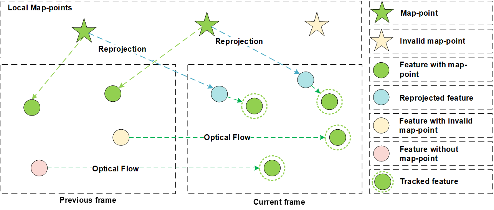

# GeoFlow-SLAM: A Robust Tightly-Coupled RGBD-Inertial and Legged Odometry Fusion SLAM for Dynamic Legged Robotics

[](https://arxiv.org/abs/2503.14247)
[](https://github.com/HorizonRobotics/geoflow-slam)


<p align="center"><em>Figure 1: System framework of GeoFlow-SLAM.</em></p>


<p align="center"><em>Figure 2: Illustration of dual-stream optical flow estimation.</em></p>


<p align="center"><em>Figure 3: Structure of the factor graph used in optimization.</em></p>

# 1. Prerequisites
We have tested the library on **Ubuntu 22.04** and **20.04**, but it should be easy to compile on other platforms. A powerful computer (e.g., i7) will ensure real-time performance and provide more stable and accurate results.

## C++17 or C++0x Compiler
We use the new thread and chrono functionalities of C++17.

## Pangolin
We use [Pangolin](https://github.com/stevenlovegrove/Pangolin) for visualization and user interface. Download and installation instructions can be found at: https://github.com/stevenlovegrove/Pangolin.

## OpenCV
We use [OpenCV](http://opencv.org) to manipulate images and features. Download and installation instructions can be found at: http://opencv.org. **Requires at least 3.0. Tested with OpenCV 3.2.0 and 4.4.0**.

## Eigen3
Required by g2o (see below). Download and installation instructions can be found at: http://eigen.tuxfamily.org. **Requires at least 3.1.0**.

## DBoW2 and g2o (Included in Thirdparty folder)
We use modified versions of the [DBoW2](https://github.com/dorian3d/DBoW2) library to perform place recognition and the [g2o](https://github.com/RainerKuemmerle/g2o) library to perform non-linear optimizations. Both modified libraries (which are BSD) are included in the *Thirdparty* folder.

## small_gicp and GMS (Included in Thirdparty folder)
The modified [GMS](https://github.com/JiawangBian/GMS-Feature-Matcher) and [small_gicp](https://github.com/koide3/small_gicp) are used.

# 2. Building the ORB-SLAM3 Library and Examples

We provide a script `build.sh` to build the *Thirdparty* libraries and *geoflow-slam*. Please make sure you have installed all required dependencies (see section 2). Execute:
```
cd geoflow-slam
chmod +x build.sh
./build.sh
```

This will create **libORB_SLAM3.so** in the *lib* folder and the executables in the *Examples* folder.

# 3. Running ORB-SLAM3 

## 3.1 Parse ROS2 bag to image, depth, imu.txt, and odom.txt

```
cd geoflow-slam/script/tools
bash parse_d435i.sh
```

## 3.2 Run GeoFlow-SLAM
```
cd geoflow-slam/script/run_orbslam
python run_rgbd_vi_g1.py
```
The ROS2 node is also provided in Examples/ROS2/RGB-D-Inertial.
# 4. Real-geoworld Experiment
<p align="center">
    
    
</p>
<p align="center">
    
    
</p>
<p align="center">
    
    
</p>


# 5. The Go2 and G1 Dataset
The datasets will be released to [unitree_legged_robotic_datasets](https://huggingface.co/datasets/HorizonRobotics/unitree_legged_robotic_datasets). 
If you use our datasets, please cite our paper.

